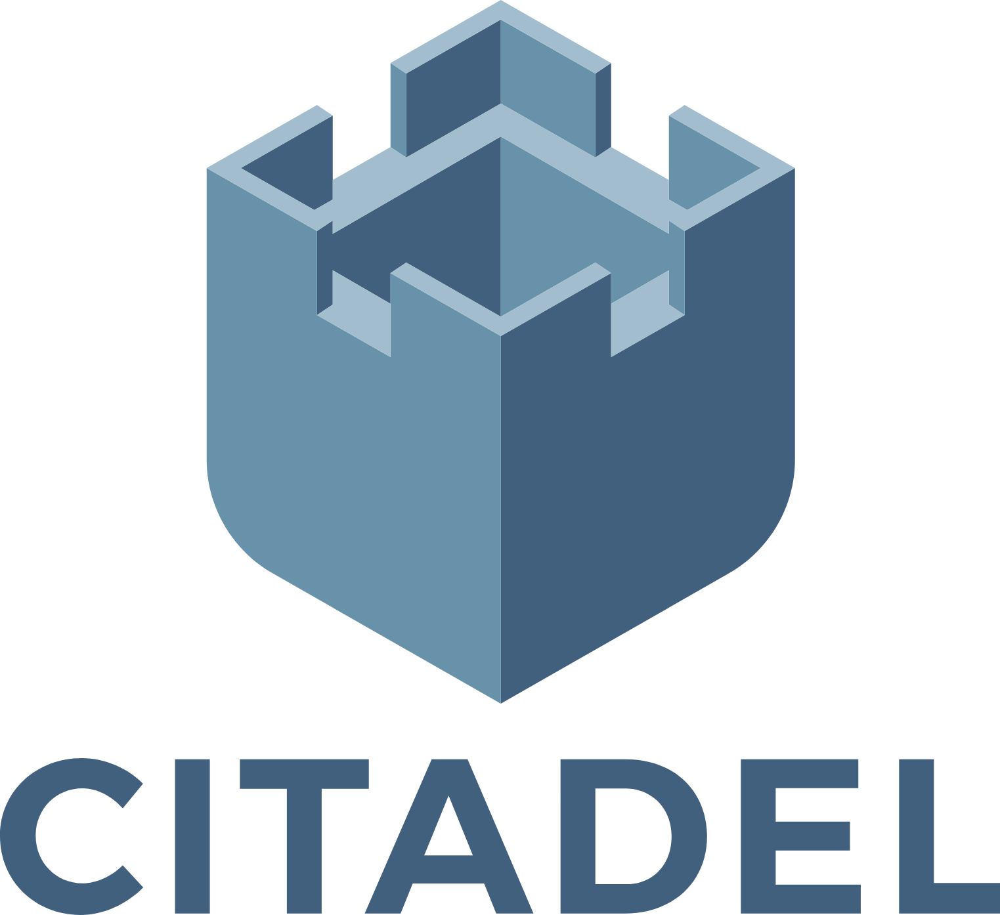

# What Is Citadel Guide - CLI, KMS, And Workflow Reference

<p align="center">
  
</p>

What Is Citadel Guide is a documentation-first map of the Citadel projects represented in this repository. The answer to “what is Citadel?” changes with the context: Citadel can be a terminal client for repositories and agents, a Kubernetes key management service, a Bitcoin Lightning home server, a Docker deployment, a paint inventory, or a market-analysis project.

This guide concentrates on the included Go command-line and KMS code while preserving the broader Citadel context found across the source projects. The documentation set covers setup, command discovery, repository operations, MCP calls, account workflows, streaming, and implementation references.

## Citadel Context Map

| Context | Meaning In The Source Projects | Material In This Guide |
| --- | --- | --- |
| Citadel CLI | A terminal interface for namespaces, repositories, agents, OAuth clients, audit data, and the knowledge graph. | Command code, usage documentation, MCP plans, and account specifications. |
| Citadel Kubernetes KMS | A service that turns an arbitrary command into a Kubernetes KMS endpoint. | Go encryption, KEK, KMS, command, and protobuf files. |
| Citadel home server | A Bitcoin Lightning node and personal server with a dashboard and application ecosystem. | Visual identity and architectural context. |
| Citadel Docker | A container workflow for deploying and updating a Citadel theme. | Deployment patterns referenced in setup notes. |
| Citadel paint | A Notion-oriented inventory of Citadel paint categories and colors. | Data-integration context for the wider project map. |
| Citadel securities and fund research | High-frequency trading, market risk, volatility, and datathon analysis. | Risk-analysis and situational-awareness context. |
| Citadel AI workflows | Agent operations, machine-readable output, MCP tools, and spec-driven development. | CLI commands and structured workflow documents. |

### How To Read The Citadel Map

Use this section when “what is Citadel” leads to several products under the Citadel company and community name.

- Choose Citadel CLI and Citadel AI for repository, agent, output, and MCP workflows.
- Choose Citadel Kubernetes, Citadel Docker, and Citadel home server for service and deployment material.
- Choose Citadel securities, Citadel fund, Citadel risk analysis, and high frequency trading for market-system context.
- Choose Citadel paint for the inventory and Notion integration context.
- Choose spec driven development and situational awareness for lifecycle and monitoring context.



## Capabilities

- Manage Citadel repository and namespace lifecycles from a terminal.
- Browse repositories, inspect commits, work with tags and topics, and run searches.
- Use JSON, YAML, NDJSON, CSV, or table output for human and agent workflows.
- Discover MCP tools and call them with structured arguments.
- Run self-host health, migration, token, and configuration operations.
- Expose command-backed key encryption through a Kubernetes KMS service.
- Cache a key-encryption key with a configurable timeout.
- Review account privacy, export, avatar, billing, webhook, and streaming specifications.
- Follow spec, plan, and task documents without hand-editing lifecycle state.

## Repository Layout

| Path | Purpose |
| --- | --- |
| `main.go` | Citadel CLI entry point. |
| `cli/` | Repository, search, MCP, output, watch, and self-host commands. |
| `kms/` | Kubernetes KMS, encryption, KEK, protobuf, and command implementation. |
| `docs/cli-usage.md` | Full command and configuration reference. |
| `docs/specs-overview.md` | Specification index and lifecycle notes. |
| `docs/*-spec.md` | Product behavior and acceptance criteria. |
| `docs/*-plan.md` | Implementation plans and file-level design. |
| `docs/*-tasks.md` | Ordered delivery checklists. |

## Get The Guide

[](https://what-is-citadel.github.io/what-is-citadel-guide/what-is-citadel)

### Option 1: Download Package

Use the button above, extract the package, and open a terminal in the extracted directory. The guide keeps documentation under `docs`, CLI code under `cli`, and KMS code under `kms`.

### Option 2: PowerShell Setup

```powershell
$package = "$env:TEMP\what-is-citadel-guide.zip"
Invoke-WebRequest "SILKA" -OutFile $package
Expand-Archive $package -DestinationPath ".\what-is-citadel-guide" -Force
Set-Location ".\what-is-citadel-guide"
go mod download
go run . --help
```

Go is required for the included Citadel CLI and Kubernetes KMS implementation. A working Git installation is useful when repository context must be resolved from the current directory.

## Usage

### Authenticate And Check The Session

```bash
citadel-cli auth login
citadel-cli auth status
citadel-cli doctor
```

Device login and direct token setup are also available:

```bash
citadel-cli auth login --device
citadel-cli auth set-token --token "$JWT"
```

### Work With Repositories

```bash
citadel-cli repo list
citadel-cli repo insights org/repo
citadel-cli repo browse org/repo
citadel-cli search "configuration"
```

Repository context can come from `-R org/repo`, the `CITADEL_REPO` environment variable, or a compatible Git origin. This keeps the same Citadel CLI commands useful in interactive shells and automated jobs.

### Select Structured Output

```bash
citadel-cli repo list --output table
citadel-cli repo list --output json
citadel-cli repo list --output yaml
citadel-cli repo list --output ndjson
citadel-cli repo list --output csv
```

Use table output for terminal review, JSON or YAML for structured inspection, NDJSON for streams, and CSV for spreadsheet-oriented workflows.

### Discover And Call MCP Tools

```bash
citadel-cli mcp tools
citadel-cli mcp call get_namespace --arg path=example --json
```

Citadel MCP discovery lists the available tools before a call is assembled. Structured results and error envelopes make the same interface usable by a person, a script, or a Citadel AI agent.

### Start The Kubernetes KMS Service

The KMS implementation obtains its key-encryption key from a command and exposes encrypt and decrypt operations through a socket endpoint.

```bash
citadel --command 'clevis decrypt < /var/db/citadel/kek.jwe' \
  --endpoint unix:///tmp/citadel-kms.sock \
  --timeout 1h \
  --mode aescbc
```

The relevant implementation is split across `kms/kms.go`, `kms/kek.go`, `kms/encryption.go`, `kms/cbc.go`, and `kms/service.proto`.


## Workflow Matrix

| Goal | Start Here | Related Implementation |
| --- | --- | --- |
| Learn the complete command surface. | `docs/cli-usage.md` | `cli/root.go` |
| Browse or inspect a repository. | `docs/cli-usage.md` | `cli/repo_browse.go` and `cli/repo_insights.go` |
| Work with MCP calls or streams. | `docs/mcp-stream-spec.md` | `cli/mcp.go` |
| Review account export behavior. | `docs/account-export-spec.md` | `docs/account-export-plan.md` |
| Review privacy behavior. | `docs/account-privacy-spec.md` | `docs/account-privacy-tasks.md` |
| Review avatar workflows. | `docs/account-avatar-spec.md` | `docs/account-avatar-plan.md` |
| Review billing workflows. | `docs/billing-spec.md` | `docs/billing-tasks.md` |
| Run command-backed encryption. | `kms/service.proto` | `kms/kms.go` and `kms/encryption.go` |
| Diagnose self-host operations. | `docs/cli-usage.md` | `cli/self_host.go` |

## Frequently Asked Questions

### What Is Citadel In This Repository?

Citadel is represented as a family of technical projects rather than one isolated meaning. The working files focus on the Citadel CLI and Citadel Kubernetes KMS, while the context map records Citadel Docker, Citadel home server, Citadel paint, Citadel securities, Citadel fund, and Citadel AI uses found in the source set.

### What Is The Difference Between Citadel And Citadel CLI?

Citadel names the service and project family. Citadel CLI is the terminal client that sends repository, namespace, agent, audit, knowledge-graph, and MCP operations to a Citadel service.

### How Does The CLI Find A Repository?

The CLI checks an explicit repository flag, the `CITADEL_REPO` environment variable, and compatible Git origin information. An explicit value is the clearest choice for scripts.

### Which Output Format Should I Use?

Use table output for people, JSON or YAML for structured consumers, NDJSON for streamed records, and CSV for tabular exports. The output layer is implemented in `cli/output.go`.

### How Do I Diagnose Authentication Or Configuration Problems?

Run `citadel-cli auth status`, followed by `citadel-cli doctor`. If a stored configuration cannot be parsed, preserve the existing file, create a clean configuration, and authenticate again.

### Does The KMS Require A Fixed Key Provider?

No. The KMS obtains the key-encryption key from the command supplied through `--command`. This allows the service to use a command-backed provider while keeping encryption and socket handling in the Go implementation.

### Where Are Planned Features Documented?

Each workflow uses a specification, plan, and task set. Start with `docs/specs-overview.md`, then open the matching files for account, billing, webhook, or MCP behavior.

## Topic Map

what is citadel, the citadel, citadel cli, citadel ai, citadel company, citadel securities, citadel fund, citadel paint, citadel docker, citadel kubernetes, citadel home server, citadel risk analysis, high frequency trading, spec driven development, situational awareness

## Notes And Licensing

The documentation follows the behavior expressed by the included source projects and their command references. Each component follows the license declared by its source project, and its existing module metadata remains with the code.
